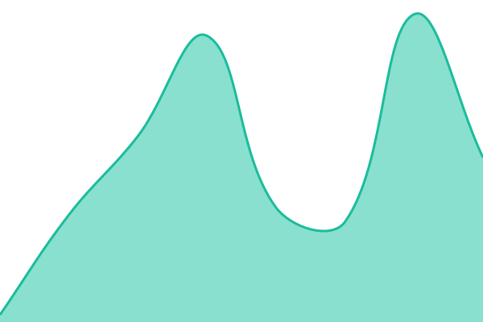

# [📈 Live Status](https://status.formenio.de): <!--live status--> **🟩 All systems operational**

This repository contains the open-source uptime monitor and status page for [David Walter](davidwalter.me), powered by [Upptime](https://github.com/upptime/upptime).

With [Upptime](https://upptime.js.org), you can get your own unlimited and free uptime monitor and status page, powered entirely by a GitHub repository. We use [Issues](https://github.com/davidwaltre/formenio-uptime/issues) as incident reports, [Actions](https://github.com/davidwaltre/formenio-uptime/actions) as uptime monitors, and [Pages](https://status.formenio.de) for the status page.

<!--start: status pages-->
<!-- This summary is generated by Upptime (https://github.com/upptime/upptime) -->
<!-- Do not edit this manually, your changes will be overwritten -->
<!-- prettier-ignore -->
| URL | Status | History | Response Time | Uptime |
| --- | ------ | ------- | ------------- | ------ |
|  App (Web-Formulare) - Haupt-Endpunkt | 🟩 Up | [app-web-formulare-haupt-endpunkt.yml](https://github.com/davidwaltre/formenio-uptime/commits/HEAD/history/app-web-formulare-haupt-endpunkt.yml) | 

 1430ms
     
 | 

<a href="https://status.formenio.de/history/app-web-formulare-haupt-endpunkt">100.00%</a>
    

|  App (Web-Formulare) - Embed-Endpunkt | 🟩 Up | [app-web-formulare-embed-endpunkt.yml](https://github.com/davidwaltre/formenio-uptime/commits/HEAD/history/app-web-formulare-embed-endpunkt.yml) | 

 9ms
     
 | 

<a href="https://status.formenio.de/history/app-web-formulare-embed-endpunkt">100.00%</a>
    

|  Backend Server | 🟩 Up | [backend-server.yml](https://github.com/davidwaltre/formenio-uptime/commits/HEAD/history/backend-server.yml) | 

 589ms
     
 | 

<a href="https://status.formenio.de/history/backend-server">100.00%</a>
    

|  Support System | 🟩 Up | [support-system.yml](https://github.com/davidwaltre/formenio-uptime/commits/HEAD/history/support-system.yml) | 

 614ms
     
 | 

<a href="https://status.formenio.de/history/support-system">100.00%</a>
    

<!--end: status pages-->

[**Visit our status website →**](https://status.formenio.de)

## 📄 License

- Powered by: [Upptime](https://github.com/upptime/upptime)
- Code: [MIT](./LICENSE) © [Anand Chowdhary](https://anandchowdhary.com), supported by [Pabio](https://pabio.com)
- Data in the `./history` directory: [Open Database License](https://opendatacommons.org/licenses/odbl/1-0/)
